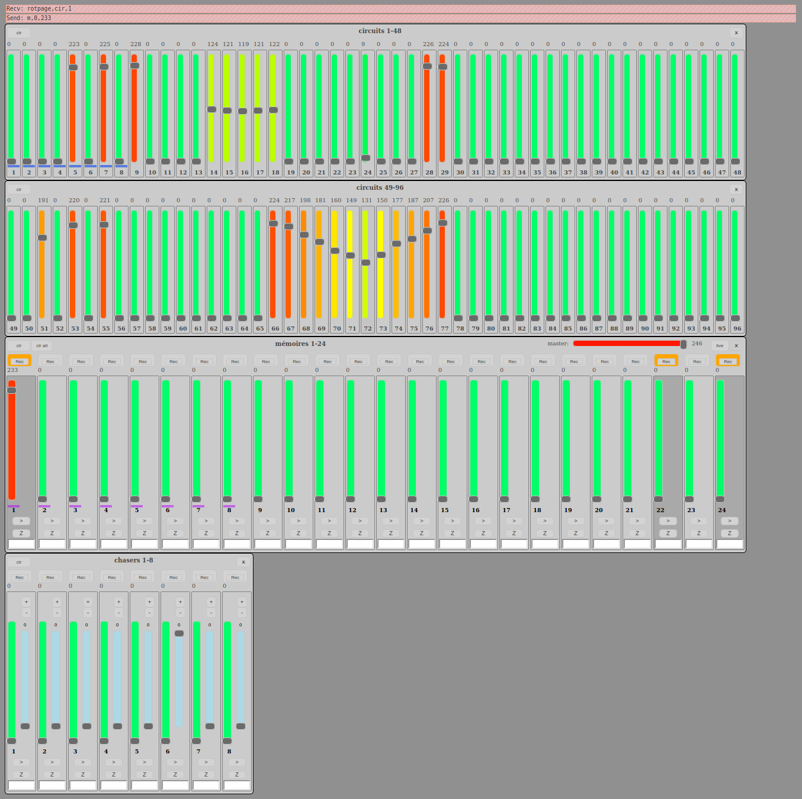

# Elianes-96-24-8
browser lighting desk with 96 circuits, 24 memories, 8 chasers

A lighting desk for browser linked thru websocket and usbSerial to a teensy DMX dongle . 

You need to download "websocketd" that fit your system : http://websocketd.com/ . 
Copy "websocketd" in "runWS.sh" folder.
runWS.sh dependency: buffer ( sudo apt install buffer )

run "runWS.sh" to start link between websocketd and serial "/dev/ttyACM0"
then open or refresh elianes96.html in your browser it should connect to websocket.

